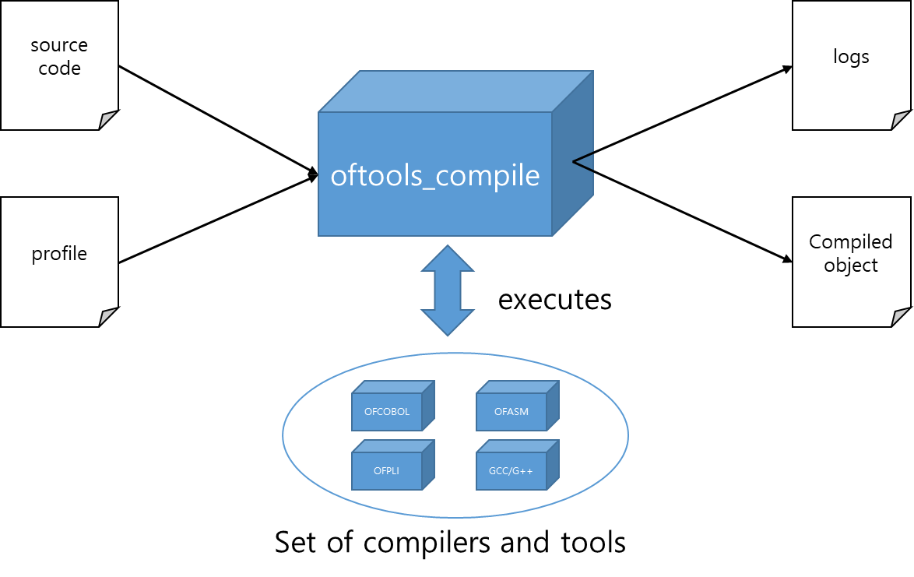
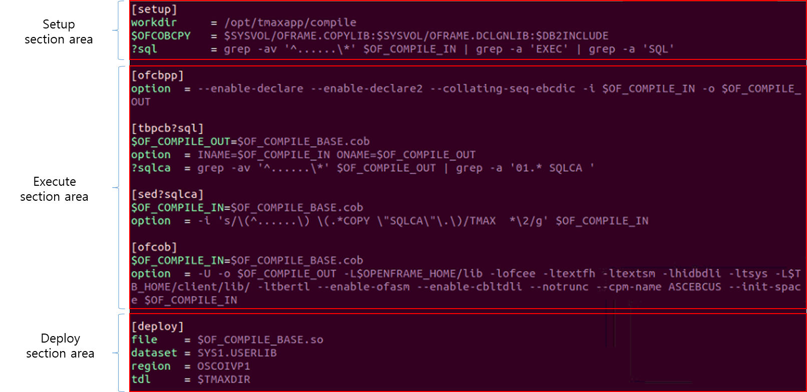
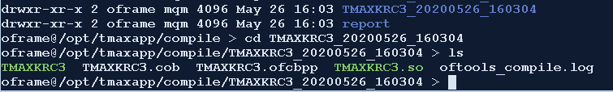
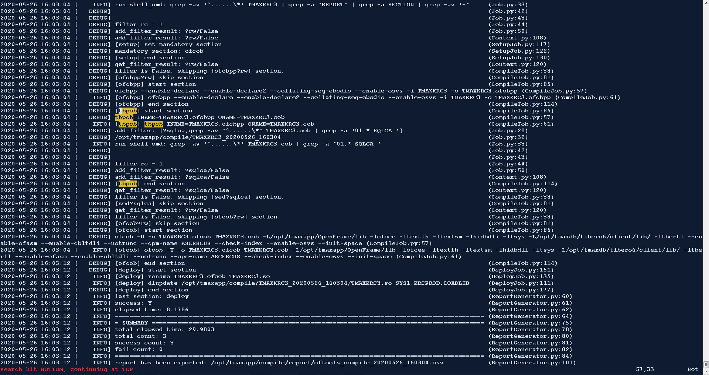
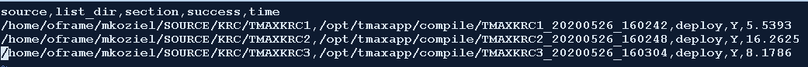

# OpenFrame Tools Compile User Guide <!-- omit in toc -->

## Table of Contents <!-- omit in toc -->

- [1. Overview](#1-overview)
- [2. Usage](#2-usage)
- [3. Profile](#3-profile)
  - [3.1 Setup section area](#31-setup-section-area)
  - [3.2 Execute section area](#32-execute-section-area)
  - [3.3 Deploy section area](#33-deploy-section-area)
  - [3.4 Environment variable](#34-environment-variable)
  - [3.5 Filter variable](#35-filter-variable)
- [4. Outputs](#4-outputs)
  - [4.1 Work Directory](#41-work-directory)
  - [4.2 Log File](#42-log-file)
  - [4.3 Report File](#43-report-file)
- [Appendix A. Profile Examples](#appendix-a-profile-examples)
  - [A.1 COBOL](#a1-cobol)

## 1. Overview

OpenFrame Tools Compile or oftools_compile is a general purpose build tool that is flexible to support multiple compilers used in OpenFrame environment.  
The diagram below shows an overview of the oftools_compile.  



## 2. Usage

```
oftools_compile -p <path_to_profile> -s <path_to_source> [options]
```

```
optional arguments:
  -h,         --help                show this help message and exit
  -p PROFILE, --profile PROFILE     profile which contains description of the compilation target.
  -s SOURCE,  --source SOURCE       name of the source which must be a file. (Or a directory if using the -r option)
  -r,         --recursive           activate recursive compilation (used when passing a directory)
  -e,         --export              export the csv formatted report file.
  -l LOG,     --log LOG             set log level (DEBUG|INFO|WARNING|ERROR|CRITICAL)
                                        DEBUG    - Show developer debug messages and higher
                                        INFO     - Show only information and higher
                                        WARNING  - Show only warnings or higher
                                        ERROR    - Show only Errors or higher
                                        CRITICAL - Show only critical errors
```

## 3. Profile

The profile is a manifest on how the build process should be executed.  
It consists of three different type of section area which are setup section area, execute section area, and deploy section area.  
Each section area consists of one or more sections and each section requires dedicated options to be defined.  Note that a section can be defined by a string surrounded by \[ \] and does not allow duplicated names.  
The environment variables and the filter variables are allowed to be defined in any of sections in the profile.



### 3.1 Setup section area

The setup section area only allows to define a 'setup' section.  A mandatory option that you need to define is the 'workdir' option.  
The 'workdir' option is a full path to the working directory which oftools_compile uses during the build process.  
For example, the source code gets copied over to 'workdir' and intermideate files gets created in the same directory. Also, the log files and report files also gets placed into the working directory.  

### 3.2 Execute section area

The execute section area is for the sections that executes external compilers and tools to build a program.  
The name of a section is mapped to the linux command to be executed appended by the 'option' defined.  
For instance, if you define a section named \[ofcbpp\], and define 'option' as "-i $OF_COMPILE_IN -o $OF_COMPILE_OUT", then the command "ofcbpp -i $OF_COMPILE_IN $OF_COMPILE_OUT" will be executed.  Sections in the execute section area must define a 'option'.

Also, This section allows to use filter variable appended to the section name. The filter variables let's you conditionally execute the section when the condition is met.  
Each compile section must define a 'option' which is used as a compile options 

Each section have it's own mandatory options to declare and for 

### 3.3 Deploy section area

### 3.4 Environment variable

The environment variable can be defined by adding '$' in the front of the name of the option.
This environment variable is equivalent to the one that is being used in the Linux system.  
Also, there are pre-defined environment variables which are $OF_COMPILE_IN, $OF_COMPILE_OUT, and $OF_COMPILE_BASE.

1. $OF_COMPILE_IN
    - Holds the input file name on given section.
    - This value gets automatically updated by previous section's $OF_COMPILE_OUT value at the time when given section gets initialized.
    - This can be override by defining $OF_COMPILE_IN in the given section.
2. $OF_COMPILE_OUT
    - Holds the output file name on given section.
    - This value gets automatically updated by replacing extension of $OF_COMPILE_IN to current sections name at the time when given section gets initialized.
    - This can be override by defining $OF_COMPILE_IN in the given section.
3. $OF_COMPILE_BASE
    - Holds the $OF_COMPILE_IN value without extension.
    - This value gets automatically updated by removing extension of $OF_COMPILE_IN at the time when given section gets initialized.
    - This can be override by defining $OF_COMPILE_BASE in the given section.

### 3.5 Filter variable

The filter variable can be defined by adding '?' in the front of the name of the option.
It is used to execute sections conditionally by adding the filter variable next to the section name.  
Base on the result of the filter variable, sections can be executed conditionally.  Note that only one section will be executed no matter how many sections are 

  gets resolved on the time when it is defined.  

## 4. Outputs

### 4.1 Work Directory

As mentioned in the [Example Profile Breakdown Section](#122-example-profile-breakdown), the workdir variable is set to /opt/tmaxapp/compile which is where the log files, report csv file, and temporary files will be stored. If we go into this directory, you can see the program names which have been compiled, the date, and time of which they have been compiled in the following format: ```PROGRAM_YYYYMMDD_HHMMSS```

Here is an example of the working directory created for the compilation of the TMAXKRC3 program would look like.



### 4.2 Log File

The log file stores information about what commands were executed. Here's a snippet of what it would look like.



In the log file, you will see that I searched for tbpcb, and you can see all of the commands that were run relating to tbpcb. First, we get some information from the profile which is displayed in the DEBUG log mode. Next, we see that the command is run:

```
[tbpcb] tbpcb INAME=TMAXKRC3.ofcbpp ONAME=TMAXKRC3.cob
```

Lastly, we apply a new filter variable for the next step

```
add_filter: [$?sqlca,grep -av '^......\*' TMAXKRC3.cob | grep -a '01.* SQLCA ']
```

This filter returns a return code of 1 which we see from the line that states:

```
filter rc = 1
```

Then, the filter result is flagged as false, and the step ends.

### 4.3 Report File

The Report file is formatted as csv or a comma delimitted file that displays: The name of the source code (fully qualified path), The directory for the listing files, the last section executed, whether the last section executed was successful or not, and the amount of time it took to complete compilation.

Here's an example:



You can see based on the example that 3 programs were compiled. TMAXKRC1, TMAXKRC2, and TMAXKRC3. All 3 were successful because they all reached the deploy stage which is the last stage of our profile, and they all executed deploy successfully.

## Appendix A. Profile Examples

### A.1 COBOL

This section shows a example for a profile that can be used to build a COBOL program.

```
[setup]
workdir     = /opt/tmaxapp/compile
# declare environment variables
$SYSVOL     = /opt/tmaxapp/OpenFrame/volume/SYSVOL
$DB2INCLUDE = $SYSVOL/DB2.INCLUDE:$SYSVOL/DB2.INCLUDE2
$OFCOBCPY   = $SYSVOL/OFRAME.COPYLIB:$SYSVOL/OFRAME.DCLGNLIB:$DB2INCLUDE
# declare filter variables
?sql        = grep -av '^......\*' $OF_COMPILE_IN | grep -a 'EXEC' | grep -a 'SQL'
?rw         = grep -av '^......\*' $OF_COMPILE_IN | grep -a 'REPORT' | grep -a 'SECTION' | grep -av '-'
?online     = grep -av '^......\*' $OF_COMPILE_IN | grep -a 'EXEC' | grep -a 'CICS'

[ofcbpp?rw]
option  = --enable-declare --enable-declare2 --collating-seq-ebcdic --enable-rw -i $OF_COMPILE_IN -o $OF_COMPILE_OUT

[ofcbpp]
option  = --enable-declare --enable-declare2 --collating-seq-ebcdic -i $OF_COMPILE_IN -o $OF_COMPILE_OUT

[tbpcb]
$OF_COMPILE_OUT=$OF_COMPILE_BASE.cob
option  = INAME=$OF_COMPILE_IN ONAME=$OF_COMPILE_OUT
?sqlca  = grep -av '^......\*' $OF_COMPILE_OUT | grep -a '01.* SQLCA '

[sed?sqlca]
$OF_COMPILE_IN=$OF_COMPILE_BASE.cob
option  = -i 's/\(^......\) \(.*COPY \"SQLCA\"\.\)/TMAX  *\2/g' $OF_COMPILE_IN

[ofcob?rw]
$OF_COMPILE_IN=$OF_COMPILE_BASE.cob
option  = -U -o $OF_COMPILE_OUT -L$OPENFRAME_HOME/lib -lofcee -ltextfh -ltextsm -lhidbdli -ltsys -L$TB_HOME/client/lib/ -ltbertl --enable-ofasm --enable-rw --enable-cbltdli --notrunc --cpm-name ASCEBCUS --init-space $OF_COMPILE_IN

[ofcob]
$OF_COMPILE_IN=$OF_COMPILE_BASE.cob
option  = -U -o $OF_COMPILE_OUT -L$OPENFRAME_HOME/lib -lofcee -ltextfh -ltextsm -lhidbdli -ltsys -L$TB_HOME/client/lib/ -ltbertl --enable-ofasm --enable-cbltdli --notrunc --cpm-name ASCEBCUS --init-space $OF_COMPILE_IN

[deploy]
file    = $OF_COMPILE_BASE.so
dataset = SYS1.USERLIB
```

The first section we have listed is the _setup_ section. In the _setup_ section, we set some variables for the script. The first variable we declare is the workdir which is the root directory for the log files and temporary files will be housed. 

Next, environment variables for the script are declared and denoted with a ```$```. This way, $SYSVOL can be referenced again in the ```$DB2INCLUDE``` variable as well as the ```$OFCOBCPY``` variable. 

In addition, we apply some filter variables. These are grep commands that will be executed before a section is executed. If the grep command receives a match, the return code will be set to 0 which will trigger the section. In other words, for the _ofcbpp_ section, if a match is found with 'REPORT' and 'SECTION', then we need to enable the report writer option ```(--enable-rw)``` which is why the _ofcbpp?rw_ has the ```--enable-rw``` option, and the normal _ofcbpp_ section does not. If there is no match, the default section will be executed without the filter variable. 

To understand the explicit naming of the files using the variables _$OF\_COMPILE\_IN_ and _$OF\_COMPILE\_BASE_, know that the precompiler tools will append extensions onto the files so that they are ready for the next step.

The output of the _ofcbpp_ command is a .ofcbpp file.
The output of the _tbpcb_ command is a .cob file.
The output of the _ofcob_ command is a .so file.

If we want to rename our files, we can modify them using the following variables:

```
[tbpcb]

|TYPE|VARIABLE|EXAMPLE|
|BASE|$OF_COMPILE_BASE|PROGRAM1|
|INPUT|$OF_COMPILE_IN|PROGRAM1.ofcbpp|
|OUTPUT|$OF_COMPILE_OUT|PROGRAM1.cob|
```

